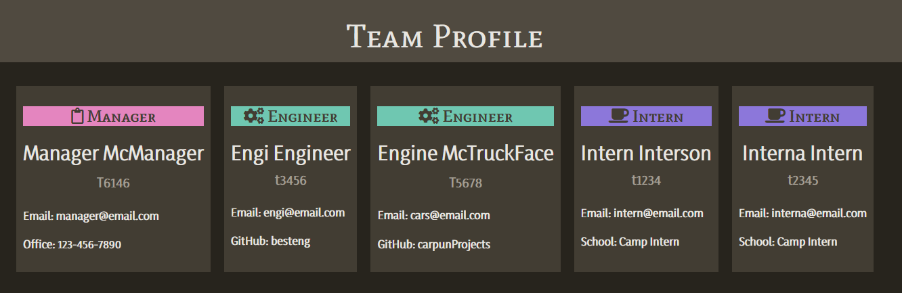

# Team Profile Generator
  
  ## Description
  *What is it and why was it made?*

  The goal of the project is to create a way for users to organize their employees by reporting manager. This project generates an html file utilizing the user's input and applies css styling to the newly-made webpage for easy viewing.

  
  ## Table of Contents
  * [Installation](#installation)
  * [Usage](#usage)
  * [Questions](#questions)
  ## Installation
  *How to install the project:*

  The program runs with node, using npm and inquirer packages. With node installed, navigate to the project folder and run the following command line: 

  `npm install`

  `npm install inquirer`

  To generate an html page, run `node index.js` in the command line.

  == Optional ==
  If needed, tests can be run using Jest. Jest can be installed after npm using `npm install jest`. Add the following the package.json generated: `{"scripts": {"test": "jest"}}`

  Now just run `jest` or `npm test` in the command land.

  An example video of the installation process can be viewed here: https://watch.screencastify.com/v/1A6NJuW5q5FYSMWCkt6f
  
  ## Usage
  *Instructions and/or Examples for utilizing the project:*

  

  A turorial video is provided at: https://watch.screencastify.com/v/HfmdJU8HwuDuNYx7pyBC
  
  

  
  
  ## Questions

  GitHub: [@BrigittePowers](https://api.github.com/users/BrigittePowers)

  Team Profile Generator is originally made by BrigittePowers. 
  If you have any questions or need specialized help, the project manager 
  can be reached at reyhn701@gmail.com. 
  Include the subject line "Team Profile Generator SUPPORT".
  